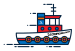
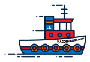
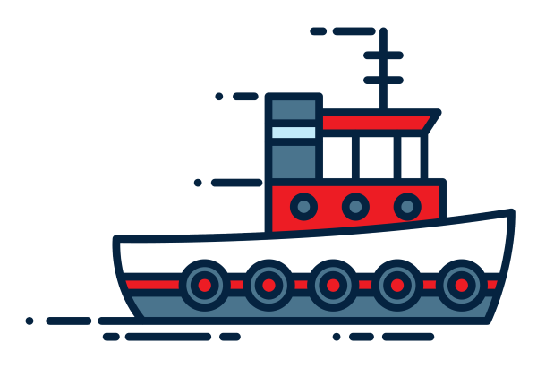
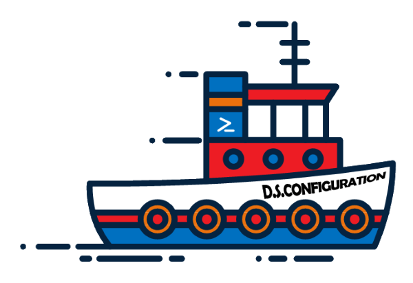

# Logo Artwork

The original icon of a tugboat comes from [Vecteezy](https://www.vecteezy.com/vector-art/131644-tugboat-vector).

The composite EPS file was converted to SVG using [CloudConvert](https://cloudconvert.com/eps-to-svg).

One of the tugboats as extracted and edited as per the Vecteezy ToCs using Visio.

We use Paint.NET to do final clean up and saving with a transparent background.

--

Used PowerPoint WordArt to create a *skewed* or curved name for the ship, christened the D.S. Configuration.

Added the PS logo to the [funnel](https://en.wikipedia.org/wiki/Funnel_(ship)).

Brightened-up the color scheme.

Copied from Visio and pasted to Paint.NET.  Scaled down and saved to each of the four stock widths:
* 600px
* 300px
* 150px
* 75px

## Attribution

Vectors by [Vecteezy.com](http://www.Vecteezy.com/)

## Embed Example

width | v1 | v2
------|----|----
` 75` |   | 
`150` |  | 
`300` |  | 
`600` |  | 
